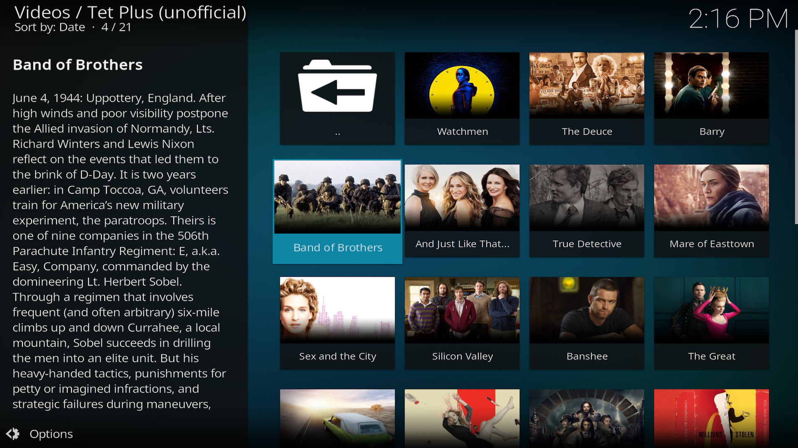
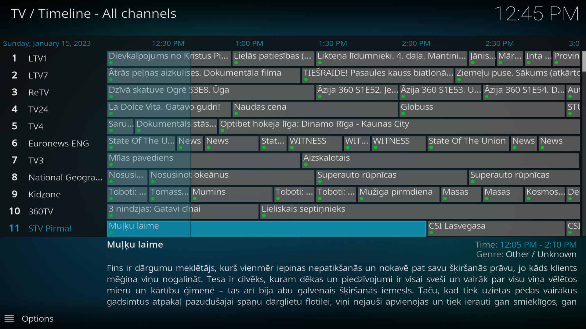
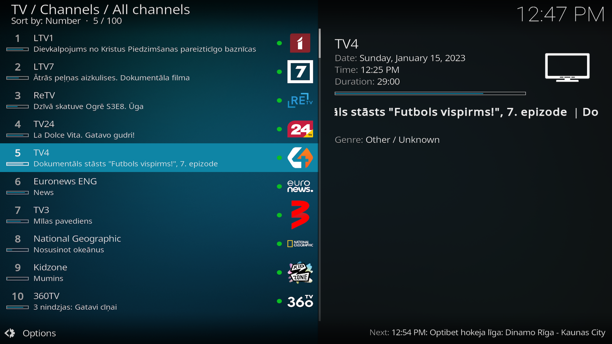

# Tet Plus Live TV Kodi addon (unofficial)

This is a community maintained unofficial Tet Plus Kodi addon.
**To use it, you must have an account on tet.plus**.

_Currently this plugin uses tet.plus web application API._


# MOTIVATION

1. Kodi is nice :) 

1. Had struggle with Tet.plus Chrome and Chromecast.

1. My old Samsung Tizen TetPlus app is ancient (seem that its not updated).

1. I am using Ruby on daily basis - its time to fiddle with Python and settle the debate (Ruby is superior anyways)

# STATUS

This is a fork of https://github.com/Camel-RD/xbmc-lattelecom.tv (which was forked from https://github.com/martinsbalodis/xbmc-lattelecom.tv)

Main goal is to make this addon compatible with Kodi Matrix (19.x)

# Features:

* authentication happy path
* live tv playback (using DASH protocol)
* Support for series (navigation, playback, pagination)
* Support for films (navigation, playback, pagination)
* Continue Watching (navigation, playback, pagination)
* EPG 

# Roadmap:

* Repository
* Watch Later
* Search movies
* Error handling


## Usage

Download this repository as a .zip file or download one of the releases from Github's releases section.
Then install it as .zip file in Kodi addons section.

__Make sure you go to addon settings to input your credentials.__

## Requirements for TV section and EPG

Addon has listed necessary addons but since not all of them are available in Kodi repository for all platforms, 
some of them are  marked as optional, more specifically `IPTV Simple` and `Inputstream Adaptive`.

`IPTV Simple` addon is necessary to enable TV section and EPG. After installing this addon, go to `Lattelecom Live TV` 
addon settings and click `Configure PVR IPTVSimple addon automatically` and then `Rebuild EPG data`. After that 
restart Kodi and it should work.

`Inputstream Adaptive` will make switching between channels almost instant. It has also support for DASH protocol and DRM protected streams (not tested if works without) 

## Screenshots

TV Series (after opening addon)



Continue watching (after opening addon)

 

Timeline in TV section



Channel view in TV section



Addon settings section

 


## FAQ

### My device has FullHD support but I get 720p stream

```
Open InputStream Adaptive addon settings and select General -> Stream Selection -> Manually select video stream and OK

(In case of Linux) - copy folder resources/inputstream.adaptive to .kodi/userdata/addon_data - after that you can pick up manually stream from settings

More info: https://github.com/xbmc/inputstream.adaptive/wiki/Stream-selection-types-properties
```
## Development

### Setup

* install kodi 19.x on your workstation
* clone this repo and move it to addon directory (https://kodi.wiki/view/Kodi_data_folder)
* open your editor, make changes and test them instantly on launched Kodi instance
* create PR against the repo :)
* PROFIT!

